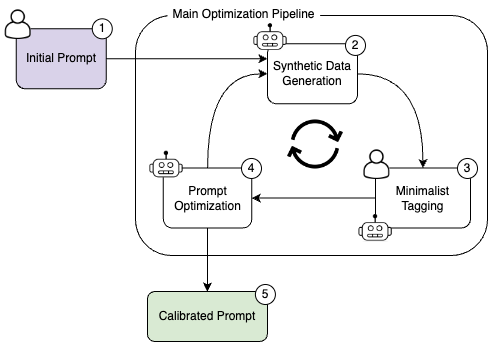

# 📝 AutoPrompt

<!-- MARKDOWN LINKS & IMAGES -->
<!-- https://www.markdownguide.org/basic-syntax/#reference-style-links -->

**Auto Prompt is a prompt optimization framework designed to enhance prompts for real-world use cases.**

*This framework is modified from [Auto Prompt](https://github.com/Eladlev/AutoPrompt/blob/main/README.md). For more set up information, it is suggested to visit the original repo.*

The framework automatically generates high-quality, detailed prompts tailored to user intentions. It employs a refinement (calibration) process, where it iteratively builds a dataset of challenging edge cases and optimizes the prompt accordingly. 

# Why Auto Prompt?
- **Prompt Engineering Challenges.** The quality of LLMs greatly depends on the prompts used. Even [minor changes](#prompt-sensitivity-example) can significantly affect their performance. 
- **Benchmarking Challenges.**  Creating a benchmark for production-grade prompts is often labour-intensive and time-consuming.
- **Reliable Prompts.** Auto Prompt generates robust high-quality prompts, offering measured accuracy and performance enhancement using minimal data and annotation steps.
- **Modularity and Adaptability.** With modularity at its core, Auto Prompt integrates seamlessly with popular open-source tools such as LangChain, Wandb, and Argilla, and can be adapted for a variety of tasks, including data synthesis and prompt migration.

## System Overview

The system is designed for real-world scenarios, such as moderation tasks, which are often challenged by imbalanced data distributions. The system implements the [Intent-based Prompt Calibration](https://arxiv.org/abs/2402.03099) method. The process requires with a user-provided initial prompt and task description, including user examples.

## 📖 Documentation
 - [How to install](docs/installation.md) (Setup instructions)
 - [Prompt optimization examples](docs/examples.md) (Use cases: movie review classification, generation, and chat moderation)
 - [How it works](docs/how-it-works.md) (Explanation of pipelines)
 - [Architecture guide](docs/architecture.md) (Overview of main components)

## Features
- 📝 Boosts prompt quality with a minimal amount of data.
- 🛬 Designed for production use cases like multi-label classification.
- ⚙️ Enables seamless migrating of prompts across model versions or LLM providers.
- 🎓 Supports prompt squeezing. Combine multiple rules into a single efficient prompt.
